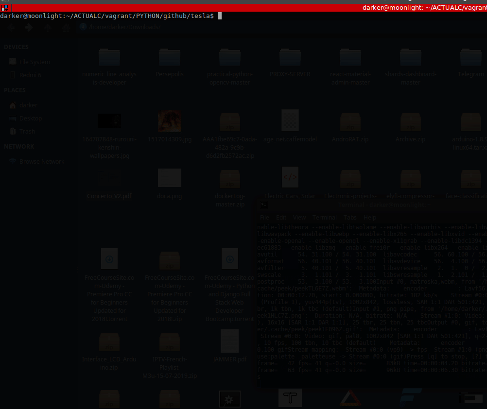

# Tesla

Tesla is the best, simple and UnnitTest tool "CrossPlatform" and "CrossLanguages" (Only Script language for now) develop by developpers for developpers based on comments in your code.
The power in this tool is that the grammar is the same for all your implementation languages.

**Note:** This project is completly experimental, am still working on it, not sure where am going with it lol.

## Features

- Tesla can do any Unittest you want from an assertion.
- Tesla Can Save Your Tests reports so that you can check it later in a persistant file.
- Tesla is light and simple.
- Tesla have a specific and very simple grammar for testing "all methods" presents in a file in one time and generate reports.
- Tesla is build from scratch so it doesn't have any dependency or any kind of troubleshooting with potentials externals libs.
- Tesla can generate for you a small and readable documentation whatever the language you're using

## Tesla can test all theese programming languages

List of languages, where you can perform tesla test:

- [Done] Python
- [Done] Javascript
- [Done] PHP
- [Working...] Ruby
- Pascal
- Perl
- Erlang
- Haskell
- Fortran
- Rust
- R

## How to config it

- First : In your code, make sure to enclose the instructions you want to test with the tesla grammar, for example:
    - In Python:
    ```python

        # For a Simple assertion:

        # ::tesla_start::
        # ::case_start::
        # >> tesla.isEqual(2, 2)
        # << true
        # ::case_end::
        # ::tesla_end::

        #
        # ::doc_start::
        #  .
        #  Here a small description of the function  that will be generate on the documentation
        #  .
        # ::doc_end::
        #

        # For more instructions:

        # ::tesla_start::
        # ::case_start::
        # >> addition(2, 2)
        # << 4
        # ::case_end::
        # ::code_start::
        # --- Your specific list of instruction / functions source code here!
        def addition(a, b):
            return a+b
        # ::code_end::
        # ::tesla_end::

    ```

    - In Javascript: 
    ```javascript

        // For a Simple assertion:

        // ::tesla_start::
        // ::case_start::
        // >> tesla.isEqual(2, 2)
        // << true
        // ::case_end::
        // ::tesla_end::


        // For more instructions:

        // ::tesla_start::
        // ::case_start::
        // >> addition(2, 2)
        // << 4
        // ::case_end::

        //
        // ::doc_start::
        //  .
        //  Here a small description of the function  that will be generate on the documentation
        //  .
        // ::doc_end::
        //

        // ::code_start::
        // --- Your specific list of instruction / functions source code here!
        function addition(a, b){
            return a+b
        }
        // ::code_end::
        // ::tesla_end::
    ```

- Second : You need to config a tesla json file or just to use what is allready config here.
    - An example of tesla config file for `Javascript`:
```php
{
    "path": ["./javascript/square.js", "./javascript/my_javascript_app/"], // All path where tesla will perform tests
    "extensions": [".js"], // extensions to be tests
    "launcher": "node", // the core
    "outputMethod": "console.log", // the default print for the appropriate language
    "commentStartBy": "//", // The default started comment
    "tryCatch": "try{ \n\t **** \n}catch(err){ \n\t console.log(es);}", // A oneline try catch to get errors when the code crash, the **** will be were the code will be place
    "function": " ", 
    "varDeclaration": "var ", // the prefix on instantiation of a variable
    "classInstantiationNew": "new ",
    "AccoladStart": "{", // This define the start of a function or a class
    "AccoladEnd": "}", // This define the end of a method or a class
    "NoneNull": "null", // Nonde for python and null for javascript
    "selfOrThis": "this", // self for python and this for javascript for example
    "selfOnFunctionParams": false, // the 'self' or 'this' parameter present on method
    "semicolomn": ";" // For thoose langage that supporting instructions only with a ";" (semicolomn)
}
```

## TEEEESSSSTTS :-)

That can look really complicated to config but in fact it's really simple and all available tsla Json file have been allready configured for you:

To test it, after cloning this repository, hit:
```shell

# First you need to cd where the json file is:
cd ./examples

# Tesla will perform tests following what it is on tjs.json
python tesla.py -c ./javascript/tesla.json

# Or for PYTHON
python tesla.py -c ./python/tesla.json

# Or for PHP
python tesla.py -c ./python/tesla.json

# Or for Ruby
python tesla.py -c ./ruby/tesla.json
```
And that's where the magic of Tesla is, for any language, you have only to write a simple JSON file and specify paths where you will do tests.


## DEMO




Records of the test will be saved in a .txt file with this format for example:
```php

##################################################################
#         |_   _| | ____| / ___|  | |        / \                 #
#           | |   |  _|   \___ \  | |       / _ \                #
#           | |   | |___   ___) | | |___   / ___ \               #
#           |_|   |_____| |____/  |_____| /_/   \_\ v0.1         #
#----------------------------------------------------------------#
#-------------------------------------------- By S@n1x d4rk3r ---#
##################################################################


| **********************************************************************************************************************************
| ---------------------------------------------------------------
|  Tesla-Test on :./javascript/square.js
| ---------------------------------------------------------------
-Test 1----------------------------------------------------------
|
| >> output == wanted
| << False
| 
| On: square
| Statement: square(9)
| output: 44
| Wanted : 3.0
| _______________________________________________________________
| 
| Status: ✗ Failed!
| End on: 0.07390022277832031 s.
| _______________________________________________________________

| **********************************************************************************************************************************
| ---------------------------------------------------------------
|  Tesla-Test on :javascript/my_javascript_app/divisionby2.js
| ---------------------------------------------------------------
-Test 2----------------------------------------------------------
|
| >> output == wanted
| << False
| 
| On: divisionby2
| Statement: divisionby2(14)
| output: 8
| Wanted : 7.0
| _______________________________________________________________
| 
| Status: ✗ Failed!
| End on: 0.07592105865478516 s.
| _______________________________________________________________

| **********************************************************************************************************************************
| ---------------------------------------------------------------
|  Tesla-Test on :javascript/my_javascript_app/multiplicationby3.js
| ---------------------------------------------------------------
-Test 3----------------------------------------------------------
|
| >> output == wanted
| << True
| 
| On: multiplicationby3
| Statement: multiplicationby3(2)
| output: 6
| Wanted : 6
| _______________________________________________________________
| 
| Status: ✓ Success!
| End on: 0.08027839660644531 s.
| _______________________________________________________________

%%%%%%%%%%%%%%%%%%%%%%%%%%%%%%%%%%%%%%%%%%%%%%%%%%%%%%%%%%%%%%%%%
%% Tesla reports:
%%
%% 3 tests done! 
%%
%% 1 succeed and 2 failed!
%% 
%% ~~~~~~~~~~~~~~~~~~~~~~~~~~~~~~~~~~~~~~~~~~~~~~
%% Tests failing:
%%    -'square' in ./javascript/square.js
%% ~~~~~~~~~~~~~~~~~~~~~~~~~~~~~~~~~~~~~~~~~~~~~~
%% Tests failing:
%%    -'divisionby2' in javascript/my_javascript_app/divisionby2.js
%% ~~~~~~~~~~~~~~~~~~~~~~~~~~~~~~~~~~~~~~~~~~~~~~
%% Running time: 0.23009967803955078 s
%%%%%%%%%%%%%%%%%%%%%%%%%%%%%%%%%%%%%%%%%%%%%%%%%%%%%%%%%%%%%%%%%
```

## How to contribute

- Clone the repository.
- Create a branch for your feature you want to add or a personnal configuration.
- Do a pull request.

## Author

- Sanix darker (Ange SAADJIO).